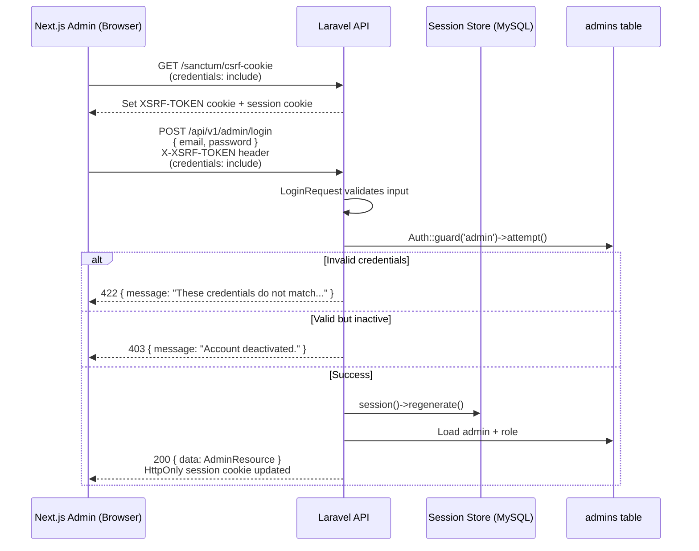
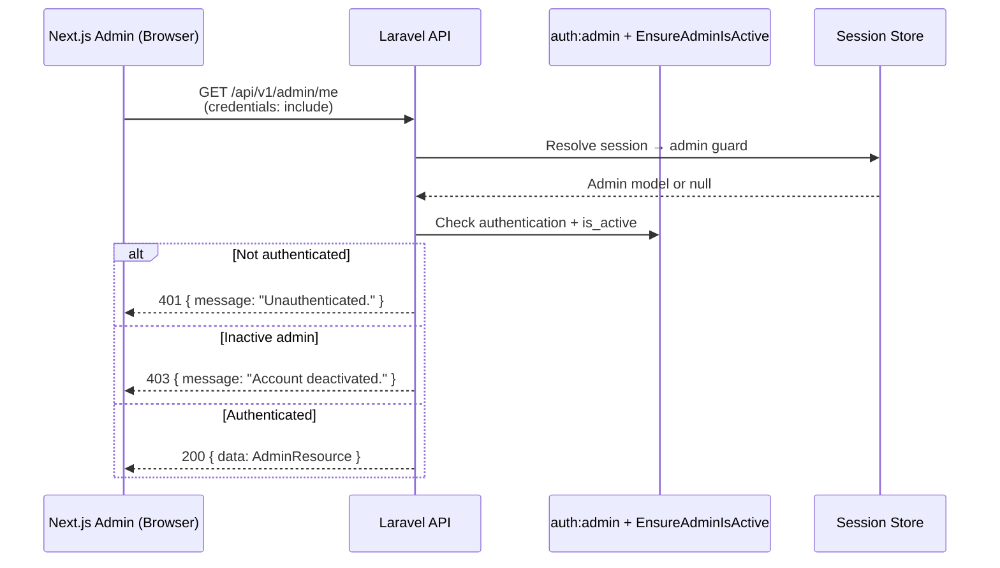
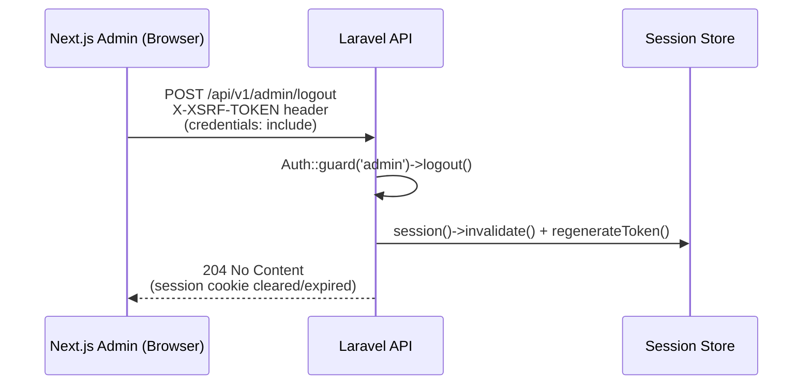

# Admin Authentication Specification

**Project:** CHINA ORDER TZ v2  
**Sprint:** 1.1 → 1.4  
**Author:** Senior Laravel Architecture Review  
**Status:** Planning — no implementation in this document

---

## 1. Codebase Review Summary

### 1.1 What already exists

| Area | Current state |
|---|---|
| **Admin model** | `Authenticatable`, UUID primary key, soft deletes, `role_id`, `is_active`, `is_super_admin`, password hashed via cast |
| **User model** | Separate customer auth model; many-to-many roles — must remain isolated from admin auth |
| **`config/auth.php`** | `admin` guard (session driver) and `admins` provider already configured; password broker for admins exists |
| **`config/session.php`** | Database driver, `http_only: true`, `same_site: lax`, lifetime 120 min |
| **`bootstrap/app.php`** | API prefix `api/v1`; no custom middleware or exception handling registered |
| **`routes/api.php`** | Health check only — no auth routes |
| **Sessions table** | Database-backed sessions migration exists (`sessions` table with nullable `user_id` FK to `users`) |
| **Admin seeder** | `admin@chinaordertz.com` / `password` seeded for development |
| **API resources** | `AdminResource` + `RoleResource` ready for `/me` responses |
| **Skeleton classes** | `AuthController`, `LoginRequest`, `LoginAdminAction`, `LogoutAdminAction`, `CurrentAdminAction`, `JwtService` |

### 1.2 What the frontend does today

The Next.js admin panel uses a **client-side mock gate**:

- Credentials verified in-browser via `NEXT_PUBLIC_ADMIN_*` env vars (`apps/web/src/lib/admin/credentials.ts`)
- Session stored in **`localStorage`** (`apps/web/src/lib/admin/session.ts`)
- A non-HttpOnly marker cookie (`china-order-tz-admin-auth`) set via JavaScript

This must be replaced with server-side Laravel authentication. The frontend already has `FRONTEND_URL` in the API `.env.example` and `NEXT_PUBLIC_API_URL` in the web app — the cross-origin wiring is anticipated but not connected.

### 1.3 Key architectural finding

`config/auth.php` already defines the correct **Admin Guard**. The missing pieces are:

1. Stateful session middleware for cross-origin SPA requests
2. CSRF protection for mutating endpoints
3. Route registration and thin controller/action layer
4. Active-admin enforcement middleware
5. Frontend migration from localStorage to cookie-based API auth

**`JwtService` is not required** for this architecture. The project requirements specify HttpOnly cookies, sessions, and CSRF — the Laravel-recommended SPA pattern. JWT bearer tokens would bypass HttpOnly cookie security and duplicate what the existing `admin` session guard already provides. **Defer or remove `JwtService`** unless a separate machine-to-machine API is introduced later.

---

## 2. Architecture Proposal

### 2.1 Recommended approach: Stateful Session Auth (Admin Guard)

Use Laravel's built-in **`admin` session guard** with **stateful API middleware** for requests originating from the Next.js frontend.

```
┌─────────────────┐         credentials + CSRF         ┌─────────────────┐
│  Next.js Admin  │ ─────────────────────────────────► │  Laravel API    │
│  (localhost:3000│ ◄── HttpOnly session cookie ────── │  (localhost:8000│
└─────────────────┘         JSON responses             └─────────────────┘
                                      │
                                      ▼
                              ┌───────────────┐
                              │ MySQL sessions│
                              │ + admins table│
                              └───────────────┘
```

**Why session auth over JWT for this project**

| Criterion | Session + HttpOnly cookie | JWT in header/localStorage |
|---|---|---|
| XSS resistance | Session ID not accessible to JS | Token often stored in JS-accessible storage |
| CSRF | Mitigated with double-submit cookie | Not applicable, but XSS risk remains |
| Logout | Server-side session invalidation | Requires token blocklist/TTL only |
| Laravel integration | Native `admin` guard already configured | Requires custom guard or package |
| Admin panel use case | Browser SPA on known domain — ideal fit | Better for mobile/third-party clients |

**Why not Sanctum personal access tokens**

Sanctum *token* auth is for mobile/CLI clients. For a Next.js admin panel on a known domain, **Sanctum SPA authentication** (session + cookie) is the correct subset — or Laravel 12's equivalent `statefulApi()` configuration without token issuance.

**Package note:** `laravel/sanctum` is not installed today. Sprint 1.2 should either install Sanctum (recommended — provides `/sanctum/csrf-cookie` and battle-tested SPA middleware) **or** implement an equivalent CSRF bootstrap route manually. This spec assumes Sanctum will be added in Sprint 1.2 as the only new package.

### 2.2 Authentication guard design

| Guard | Provider | Driver | Used by |
|---|---|---|---|
| `web` | `users` | session | Future customer storefront (out of scope) |
| `admin` | `admins` | session | Admin panel API (`/api/v1/admin/*`) |

Rules:

- All admin auth routes explicitly use `Auth::guard('admin')` or `auth:admin` middleware.
- Default guard (`web`) remains unchanged — admin and customer auth never share a guard.
- Admin login must call `$request->session()->regenerate()` after successful authentication to prevent session fixation.

### 2.3 Layer responsibilities

| Layer | Responsibility |
|---|---|
| **`AuthController`** | Thin HTTP adapter — delegates to Actions, returns JSON + resources |
| **`LoginRequest`** | Input validation (email format, password required) |
| **`LoginAdminAction`** | Credential attempt, active check, session regeneration, return `Admin` |
| **`LogoutAdminAction`** | Guard logout, session invalidate, token regeneration |
| **`CurrentAdminAction`** | Resolve authenticated admin, eager-load role, return `Admin` |
| **`EnsureAdminIsActive`** | Middleware — reject deactivated or soft-deleted admins with 403 |
| **`AdminResource`** | Serialize admin + role for `/me` and login response |

No service class is needed unless Sanctum installation introduces configuration helpers. **`JwtService` should not be implemented.**

### 2.4 Session handling

| Setting | Development | Production |
|---|---|---|
| `SESSION_DRIVER` | `database` (already set) | `database` or `redis` |
| `SESSION_LIFETIME` | `120` (2 hours idle) | `120` or stricter (e.g. `60`) |
| `SESSION_HTTP_ONLY` | `true` | `true` |
| `SESSION_SECURE_COOKIE` | `false` (localhost) | `true` |
| `SESSION_SAME_SITE` | `lax` | `lax` |
| `SESSION_DOMAIN` | `null` (localhost works) | `.yourdomain.com` |
| `SANCTUM_STATEFUL_DOMAINS` | `localhost:3000,127.0.0.1:3000` | `admin.yourdomain.com,yourdomain.com` |

The Laravel session cookie (`{app-name}-session`) is **HttpOnly** and holds the encrypted session ID. The admin's authenticated state is stored server-side in the `sessions` table payload under the `login_admin_{hash}` key.

### 2.5 CSRF strategy

For a cross-origin Next.js SPA posting to Laravel:

1. **Preflight:** Frontend calls `GET /sanctum/csrf-cookie` (or equivalent) with `credentials: 'include'`.
2. **Cookie set:** Laravel sets `XSRF-TOKEN` cookie (readable by JavaScript, not HttpOnly).
3. **Mutating requests:** Frontend sends `X-XSRF-TOKEN` header matching the cookie value on all `POST`/`PUT`/`PATCH`/`DELETE` requests.
4. **Session cookie:** Sent automatically by the browser (`credentials: 'include'`).

CSRF-exempt routes: **none** for admin auth — login and logout must be CSRF-protected.

Implementation requires `statefulApi()` (or Sanctum's middleware stack) so that `StartSession`, `EncryptCookies`, and `VerifyCsrfToken` apply to API routes from stateful domains.

### 2.6 Error response contract

All admin auth endpoints return JSON. Use standard Laravel HTTP status codes:

| Scenario | Status | Body shape |
|---|---|---|
| Validation failure | `422` | `{ "message": "...", "errors": { "email": ["..."] } }` |
| Invalid credentials | `422` | `{ "message": "These credentials do not match our records." }` |
| Inactive admin (login) | `403` | `{ "message": "Your admin account has been deactivated." }` |
| Unauthenticated | `401` | `{ "message": "Unauthenticated." }` |
| Inactive admin (middleware) | `403` | `{ "message": "Your admin account has been deactivated." }` |
| Success (login/me) | `200` | `{ "data": { AdminResource } }` |
| Success (logout) | `204` | Empty body |

Register a global exception renderer in `bootstrap/app.php` so `AuthenticationException`, `ValidationException`, and `AuthorizationException` always return JSON (never HTML redirects) for `api/v1/*` requests.

### 2.7 Validation strategy

| Field | Rules | Notes |
|---|---|---|
| `email` | `required`, `string`, `email`, `max:255` | Normalized to lowercase before lookup |
| `password` | `required`, `string`, `min:8` | Never returned in responses |

Validation lives exclusively in `LoginRequest`. Actions receive already-validated input via `$request->validated()`.

Credential verification uses `Auth::guard('admin')->attempt($credentials, $remember)` inside `LoginAdminAction`. On failure, throw `ValidationException` with a generic message (do not reveal whether email exists).

Post-authentication checks in `LoginAdminAction`:

- `is_active === true`
- Admin not soft-deleted (automatic via Eloquent if using default query scope, or explicit check)

---

## 3. Recommended File Structure

```
apps/api/
├── app/
│   ├── Actions/
│   │   └── AdminAuth/
│   │       ├── LoginAdminAction.php          ✅ exists (skeleton)
│   │       ├── LogoutAdminAction.php         ✅ exists (skeleton)
│   │       └── CurrentAdminAction.php        ✅ exists (skeleton)
│   │
│   ├── Http/
│   │   ├── Controllers/
│   │   │   └── Admin/
│   │   │       └── AuthController.php        ✅ exists (skeleton)
│   │   │
│   │   ├── Middleware/
│   │   │   └── EnsureAdminIsActive.php       🆕 Sprint 1.3
│   │   │
│   │   ├── Requests/
│   │   │   └── Admin/
│   │   │       └── LoginRequest.php          ✅ exists (skeleton)
│   │   │
│   │   └── Resources/
│   │       ├── AdminResource.php             ✅ exists
│   │       └── RoleResource.php              ✅ exists
│   │
│   └── Services/
│       └── JwtService.php                    ⛔ not needed — remove or leave unused
│
├── bootstrap/
│   └── app.php                               📝 Sprint 1.2 — middleware + exceptions
│
├── config/
│   ├── auth.php                              ✅ admin guard configured
│   ├── session.php                           ✅ ready
│   └── cors.php                              🆕 Sprint 1.2 — publish if needed
│
├── routes/
│   └── api.php                               📝 Sprint 1.3 — admin auth route group
│
└── .env.example                              📝 Sprint 1.2 — stateful domain vars
```

**Frontend files to update (Sprint 1.4 — out of Laravel scope but noted here):**

```
apps/web/src/
├── lib/
│   └── admin/
│       ├── api-client.ts          🆕 fetch wrapper with credentials + CSRF
│       ├── session.ts             📝 remove localStorage auth
│       └── credentials.ts         📝 remove client-side verification
└── components/admin/
    └── AdminAuthProvider.tsx      📝 call Laravel /me, /login, /logout
```

---

## 4. Authentication Sequence Diagrams

### 4.1 Login flow



### 4.2 Authenticated request (/me)



### 4.3 Logout flow



---

## 5. API Endpoints

Base prefix: **`/api/v1/admin`**

| Method | Path | Auth | Middleware | Controller method | Action | Description |
|---|---|---|---|---|---|---|
| `GET` | `/sanctum/csrf-cookie` | Public | Stateful API | — (Sanctum route) | — | Bootstrap CSRF token |
| `POST` | `/admin/login` | Public | Stateful API, throttle | `AuthController@login` | `LoginAdminAction` | Authenticate admin |
| `GET` | `/admin/me` | Required | `auth:admin`, `admin.active` | `AuthController@me` | `CurrentAdminAction` | Current admin profile |
| `POST` | `/admin/logout` | Required | `auth:admin`, `admin.active`, Stateful API | `AuthController@logout` | `LogoutAdminAction` | End session |

### 5.1 Route registration sketch (for Sprint 1.3)

```php
// routes/api.php — illustrative only, not implemented yet

Route::prefix('admin')->group(function () {
    Route::post('/login', [AuthController::class, 'login'])
        ->middleware('throttle:admin-login');

    Route::middleware(['auth:admin', 'admin.active'])->group(function () {
        Route::get('/me', [AuthController::class, 'me']);
        Route::post('/logout', [AuthController::class, 'logout']);
    });
});
```

Rate limiter `admin-login`: 5 attempts per minute per IP + email combination.

### 5.2 Response examples

**POST /api/v1/admin/login — 200**

```json
{
  "data": {
    "id": "uuid",
    "name": "Super Admin",
    "email": "admin@chinaordertz.com",
    "phone": "0712345678",
    "is_super_admin": true,
    "is_active": true,
    "role": {
      "id": "uuid",
      "name": "Administrator",
      "slug": "administrator",
      "description": "..."
    },
    "created_at": "2026-06-25T00:00:00+00:00",
    "updated_at": "2026-06-25T00:00:00+00:00"
  }
}
```

**GET /api/v1/admin/me — 200**

Same shape as login response.

**POST /api/v1/admin/logout — 204**

Empty body.

---

## 6. Security Considerations

### 6.1 Cookie security

| Cookie | HttpOnly | Purpose |
|---|---|---|
| `{app}-session` | **Yes** | Encrypted session ID — admin auth state |
| `XSRF-TOKEN` | No (by design) | CSRF double-submit — JS reads and sends as header |

Production checklist:

- `SESSION_SECURE_COOKIE=true` (HTTPS only)
- `SESSION_HTTP_ONLY=true` (already default)
- `SESSION_SAME_SITE=lax` (adjust to `none` + secure only if admin and API are on different registrable domains)

### 6.2 CSRF

- All state-changing admin auth endpoints require valid CSRF token.
- Never exempt `/admin/login` or `/admin/logout` from CSRF verification.
- Frontend must fetch CSRF cookie before the first mutating request.

### 6.3 Credential and account protection

- Generic error message on failed login (no email enumeration).
- Rate limit login: 5/minute per IP (configurable via `RateLimiter` in `AppServiceProvider` or `bootstrap/app.php`).
- Reject login for `is_active = false` before establishing session.
- `EnsureAdminIsActive` middleware catches deactivated admins mid-session.
- Session regeneration on login prevents session fixation.
- Full session invalidation on logout.
- Password never included in `AdminResource` (already excluded via `$hidden` on model).

### 6.4 Separation of admin and customer auth

- Admin routes use `auth:admin` — never `auth:web` or default guard.
- Customer `User` model auth is a separate sprint — do not merge guards.
- Admin seeder credentials (`admin@chinaordertz.com`) must not be mirrored in `NEXT_PUBLIC_*` env vars in production.

### 6.5 CORS

Publish and configure `config/cors.php`:

```php
'paths' => ['api/*', 'sanctum/csrf-cookie'],
'allowed_origins' => [env('FRONTEND_URL')],
'supports_credentials' => true,
```

Without `supports_credentials: true`, browsers will not send HttpOnly session cookies on cross-origin requests.

### 6.6 Frontend migration security note

The current Next.js admin gate (localStorage + env-var passwords) is **not production-safe** and must be fully replaced. Until Sprint 1.4 is complete, the admin panel should be treated as development-only.

### 6.7 Optional hardening (future sprints)

- Admin login audit log (IP, user agent, timestamp)
- Account lockout after N failed attempts
- Separate `admin_sessions` table column for session auditing
- Two-factor authentication for super admins
- IP allowlisting for production admin panel

---

## 7. Development Order (Sprint Plan)

### Sprint 1.2 — Infrastructure & Middleware Foundation

**Goal:** Enable stateful cookie auth from Next.js origin.

| # | Task | Files |
|---|---|---|
| 1 | Install `laravel/sanctum` | `composer.json` |
| 2 | Publish Sanctum config + run migration (personal_access_tokens — unused for SPA but harmless) | `config/sanctum.php` |
| 3 | Enable `statefulApi()` in bootstrap | `bootstrap/app.php` |
| 4 | Register middleware alias `admin.active` | `bootstrap/app.php` |
| 5 | Configure JSON exception responses for API | `bootstrap/app.php` |
| 6 | Publish/configure CORS with credentials | `config/cors.php`, `.env.example` |
| 7 | Add env vars: `SANCTUM_STATEFUL_DOMAINS`, `SESSION_SECURE_COOKIE` | `.env.example` |
| 8 | Define `admin-login` rate limiter | `AppServiceProvider` or `bootstrap/app.php` |
| 9 | Verify CSRF cookie endpoint: `GET /sanctum/csrf-cookie` | Manual test |

**Exit criteria:** CSRF cookie + session cookie returned to `localhost:3000` origin with `credentials: include`.

---

### Sprint 1.3 — Admin Auth Backend Implementation

**Goal:** Working login, logout, and /me endpoints.

| # | Task | Files |
|---|---|---|
| 1 | Implement `LoginRequest` validation rules | `LoginRequest.php` |
| 2 | Implement `LoginAdminAction` | `LoginAdminAction.php` |
| 3 | Implement `LogoutAdminAction` | `LogoutAdminAction.php` |
| 4 | Implement `CurrentAdminAction` | `CurrentAdminAction.php` |
| 5 | Implement `EnsureAdminIsActive` middleware | `EnsureAdminIsActive.php` |
| 6 | Implement `AuthController` methods (thin) | `AuthController.php` |
| 7 | Register admin auth routes | `routes/api.php` |
| 8 | Feature tests: login success/failure, inactive admin, me, logout | `tests/Feature/Admin/Auth/` |

**Exit criteria:** All endpoints pass feature tests; Postman/Insomnia login flow works with cookies.

---

### Sprint 1.4 — Next.js Frontend Integration

**Goal:** Replace mock auth with Laravel session auth.

| # | Task | Files |
|---|---|---|
| 1 | Create admin API client (`credentials: 'include'`, CSRF header) | `apps/web/src/lib/admin/api-client.ts` |
| 2 | Rewrite `AdminAuthProvider` to call `/me` on mount | `AdminAuthProvider.tsx` |
| 3 | Connect login form to `POST /admin/login` | `AdminLoginContent.tsx` |
| 4 | Connect logout to `POST /admin/logout` | `AdminHeader.tsx` |
| 5 | Remove localStorage session + client credential verification | `session.ts`, `credentials.ts` |
| 6 | Remove `NEXT_PUBLIC_ADMIN_PASSWORD` from production env docs | `.env.example` |

**Exit criteria:** Admin panel authenticates against seeded Laravel admin; browser DevTools shows HttpOnly session cookie from API domain.

---

### Sprint 1.5 — Production Hardening & QA

| # | Task |
|---|---|
| 1 | Set production env vars (`SESSION_SECURE_COOKIE`, `SANCTUM_STATEFUL_DOMAINS`, `FRONTEND_URL`) |
| 2 | Confirm HTTPS cookie behavior in staging |
| 3 | Load test login rate limiter |
| 4 | Document admin auth flow in project README |
| 5 | Remove or archive unused `JwtService` skeleton |

---

## 8. Decision Log

| Decision | Choice | Rationale |
|---|---|---|
| Auth mechanism | Session guard (`admin`) | Already configured; HttpOnly cookies; server-side logout |
| Token/JWT | **Not used** | Conflicts with HttpOnly cookie requirement; `JwtService` unnecessary |
| Sanctum | Install for SPA middleware + CSRF route | Laravel ecosystem standard for Next.js + Laravel |
| Session storage | Database (existing) | Already migrated; upgrade to Redis in production if needed |
| Guard isolation | `admin` guard only for admin routes | Keeps customer `web`/`users` auth separate |
| Controller pattern | Thin controller + Action classes | Matches existing skeleton; testable single-responsibility units |
| Validation | Form Request only | Laravel 12 best practice; keeps actions free of HTTP concerns |

---

## 9. Out of Scope (This Feature)

- Customer/user authentication
- Password reset for admins
- Role-based permission middleware (beyond `is_super_admin` / `role_id` presence)
- API token auth for mobile or third-party integrations
- Model or migration changes
- Admin CRUD management UI

---

*This document is the authoritative plan for Admin Authentication in CHINA ORDER TZ v2. Implementation sprints should reference this spec and update it if architectural decisions change.*
